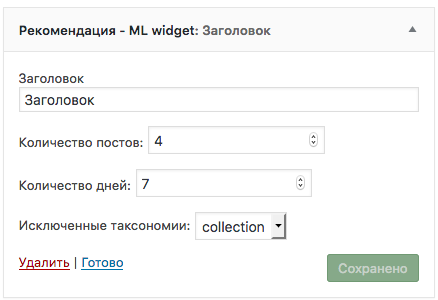

## Как работает 

В настройках виджета можно задать заголовок, количество постов, таксономию для исключения постов входящих в нее, количество дней за которое нужно выводить посты.

При выводе постов учитываются теги которым принадлежит пост на странице которого выводится виджет.

Добавил кэширование контента виджета, благодаря чему SQL запросы будут меньше сказываться на производительности сервера, и в целом происходить быстреее.

Добавил инвалидацию кеша.

=======================

Для отдельного поста можно выбрать его видимость в виджете рекомендации с помощью метабокса.

При выводе виджета например на странице со списком постов записи в виджете не будут появляться если например все они уже 
есть на этот странице, например в блоге 10 записей и все они выведены на главной в таком случае в виджете ничего не появится.
 
=======================

P.S. файл типо  gulpfile.js , package.json и так даже лишь на первый взгляд лишние на самом деле они помогают быстрее
разрабатывать и вносить изменения например создавать файлы локализации. Скрипты в каталоге core, Autoloader и прочие
 помогают реализовывать более удобный и современный процесс работы с php нежели сейчас приходится видеть в WordPress 
 например это дается реализацию стандартов PSR и возможность использовать лучшие практики в написании ООП кода. Все это 
 вместе часть  моего прошлого Open Source проекта который можно посмотреть [тут](http://github.com/petrozavodsky/wordpress-magic-boilerplate) 